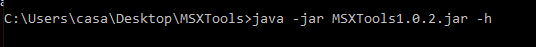
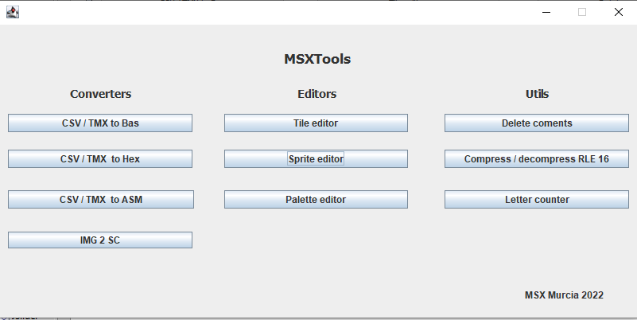
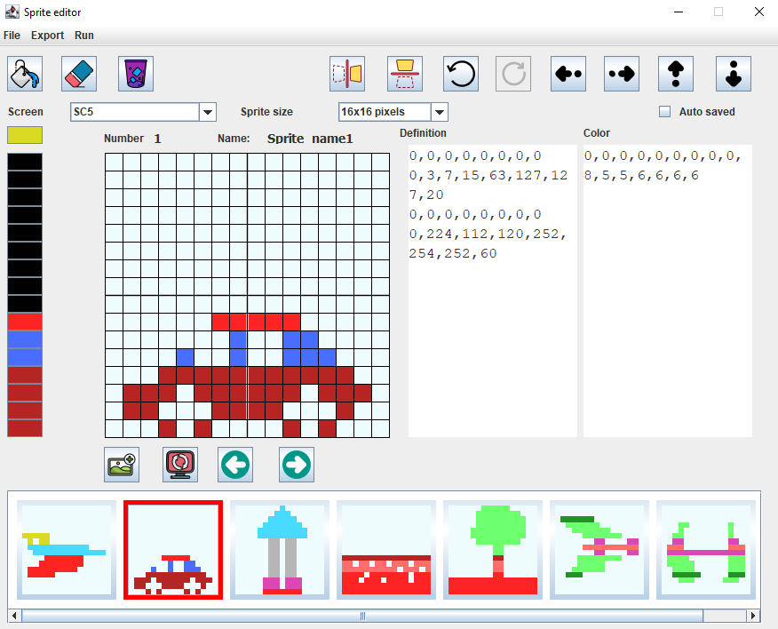

# Instruciones / Instructions

MSXTools es un conjunto de programas para ayudarte con la programación de tu MSX.

MSX Tools is a set of programs to help you with programming your MSX.

Puedes descargarlo pinchado aquí / You can download it by clicking here: 

https://github.com/kikemadrigal/Java-desktop-MSXtools/releases/tag/v1.0.2

# Command line

La aplicación puede ser gestiona a través de la línea de comandos

Si no escribes nada o si haces doble click en el ejectuable se abrirá el menú principal:

# Sprite editor

Coversores

    1 Gestionar tus sprites 
    2 Exportarlos a un archivo basic
    3 Exportarlos a un archivo binario
    4 La opción de autoguardado es muy util para que tan solo tengas que poner este comando en tu script: java -jar MSXTools.jar -m=b -0=file.spr
    5 Ejecutar openMSX con estos archivos.

